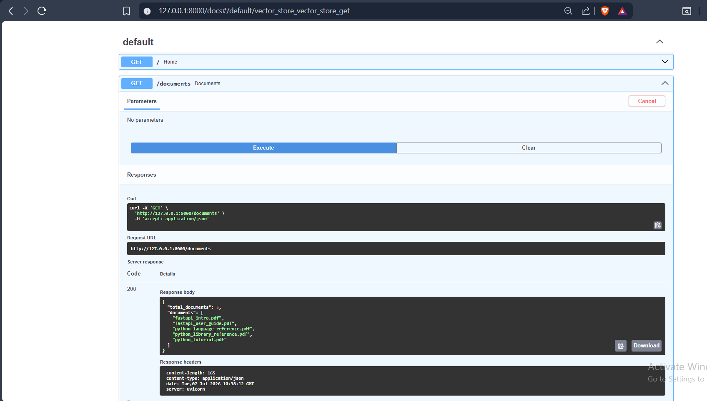
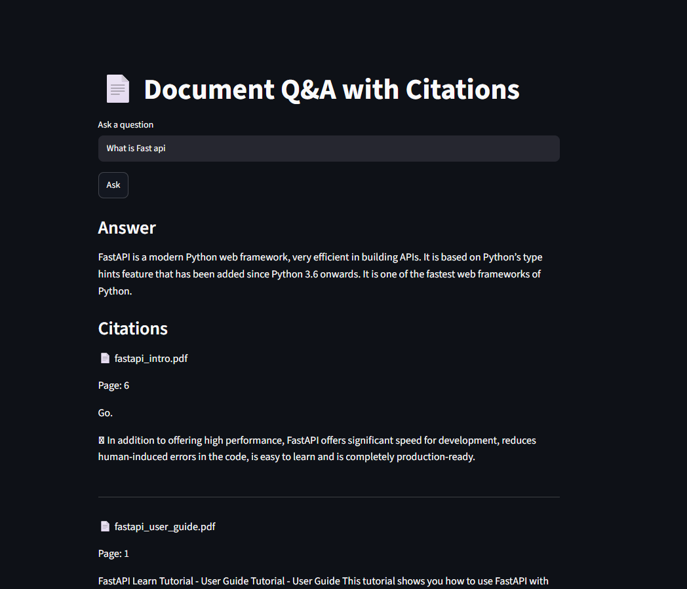
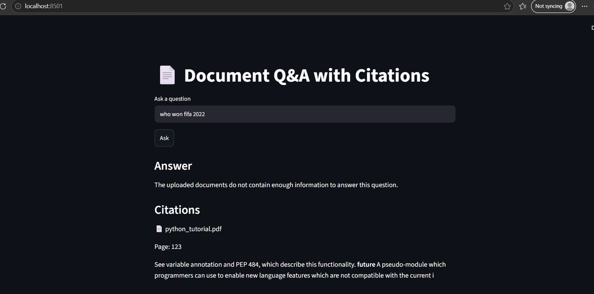

# Potens Internship 2026 - AI/ML Assignment

## Candidate

Atharva Patil

## Question Chosen

AI/ML – Q1: Document Q&A with Citations

---

## Project Overview

This project is a Retrieval-Augmented Generation (RAG) application that answers questions using uploaded PDF documents instead of relying solely on a language model.

The application reads PDF documents, splits them into chunks, converts each chunk into vector embeddings, stores them in a FAISS vector database, retrieves the most relevant chunks for a user's question, and generates an answer using an LLM.

If the answer is not available in the uploaded documents, the application explicitly informs the user instead of generating incorrect information.

---

## Features

- PDF document ingestion
- Automatic text chunking
- Sentence Transformer embeddings
- FAISS vector database
- Semantic search
- FastAPI REST API
- Streamlit interface
- Answer generation using Groq Llama 3.3
- Source citations
- Page number references
- No hallucination outside uploaded documents

---

## Technologies Used

- Python
- FastAPI
- LangChain Text Splitters
- FAISS
- Sentence Transformers
- Groq API
- Streamlit
- PyMuPDF

---

## Folder Structure

```
app/
documents/
streamlit_app.py
requirements.txt
README.md
```

---

## Installation

Create a virtual environment.

```bash
python -m venv venv
```

Activate it.

Windows

```bash
venv\Scripts\activate
```

Install dependencies.

```bash
pip install -r requirements.txt
```

Create a `.env` file.

```
GROQ_API_KEY=your_api_key
```

---

## Running the FastAPI Server

```bash
uvicorn app.main:app --reload
```

Swagger UI

```
http://127.0.0.1:8000/docs
```

---

## Running Streamlit

```bash
streamlit run streamlit_app.py
```

---

## API Endpoints

### GET /

Checks whether the API is running.

### GET /documents

Lists all uploaded PDF documents.

### GET /chunks

Shows the total number of chunks.

### GET /vector-store

Shows the number of vectors stored.

### POST /ask

Accepts a question and returns:

- Answer
- Source document
- Page number
- Supporting snippet

### POST /contradict

Compares two documents and reports whether they contradict each other.

---

## Chunking Strategy

The documents are split using Recursive Character Text Splitter.

- Chunk Size: 500 characters
- Chunk Overlap: 100 characters

The overlap helps preserve context between consecutive chunks while improving retrieval quality.

---

## Future Improvements

- Persistent FAISS index
- Better contradiction detection
- Confidence score
- Multi-document reranking
- Docker deployment

---

## Known Limitations

- FAISS index is recreated when the server starts.
- Tested with PDF documents only.
- Requires an internet connection for the Groq API.

---

## AI Use Log

| Tool | Purpose |
|------|---------|
| ChatGPT | Project planning, debugging, implementation guidance, README preparation |

Approximately 15-20 prompts were used during development.


## Screenshots

### FastAPI Swagger




### Question Answering



### Unknown Question Handling

